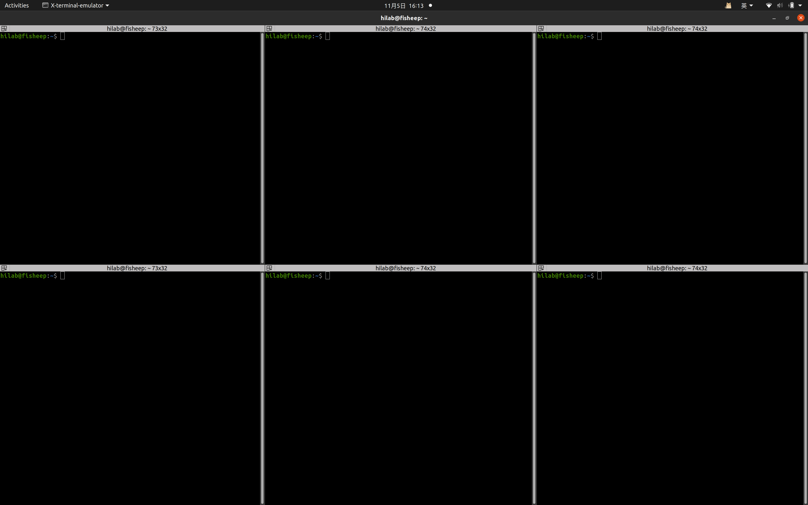
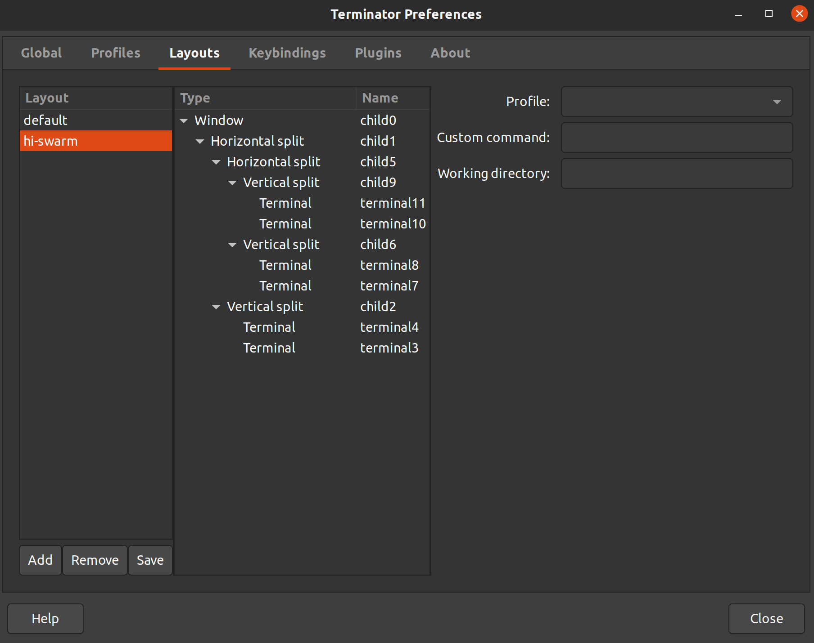

# scripts_repo

🚀 自动化脚本仓库

new branch

## 1 安装依赖

```sh
sudo apt-get install terminator
sudo apt install python3-pip
pip3 install pyautogui
```

## 2 使用方法

### `./config_ssh.sh`：免密SSH一键配置

- 🌟 使用方法：修改脚本内`ssh_ip`为你的远程用户名与ip

### `./docker.sh`：打开自定义终端布局，所有终端自动进入docker

- 🌟 使用方法：首先自定义Terminator的终端布局，修改脚本内`container_id`为你的容器id，修改`layout_name`为你的终端布局名，修改`terminal_num`为你终端布局的终端数

- ❗注意事项：运行脚本时请保持Terminator窗口全屏化，多显示器下暂不支持，需要在远程使用以下命令给docker添加权限

```sh
sudo groupadd docker
sudo gpasswd -a $USER docker
sudo usermod -aG docker $USER
sudo service docker restart
newgrp docker
```

- 💦 自定义Terminator终端布局的方法如下：

首先关闭所有终端，然后在工作空间下开一个终端，分割出你需要的终端数（比如6个）并将输入框定位到左上角，注意终端必须开全屏

<div align="center">

</div>

然后右键Preferences保存该终端布局，你需要记住该终端布局的名称（比如hi-swarm）

<div align="center">

</div>

### `./ssh_docker.sh`：打开自定义终端布局，所有终端自动ssh连接并进入docker

- 🌟 使用方法：首先自定义Terminator的终端布局，修改脚本内`container_id`为你的容器id，修改`ssh_ip`为你的usr@ip，修改`layout_name`为你的终端布局名，修改`terminal_num`为你终端布局的终端数

- ❗注意事项：运行脚本时请保持Terminator窗口全屏化，多显示器下暂不支持
